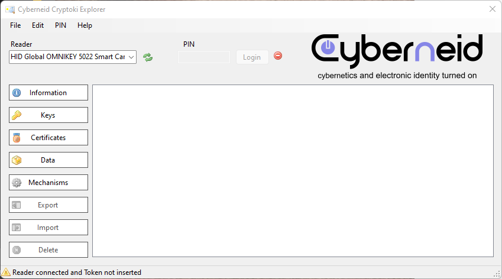
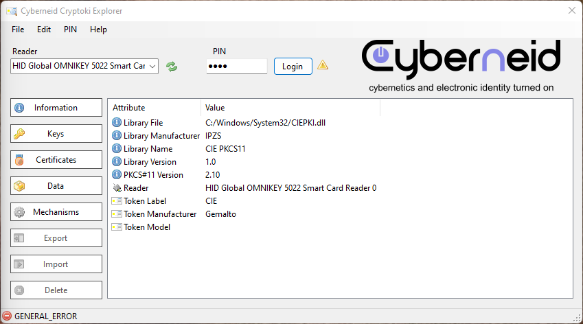
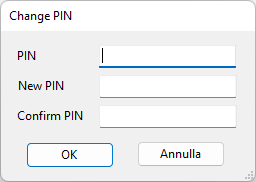
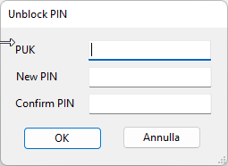
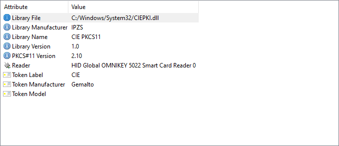
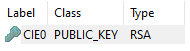
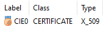

# CryptokiExplorer

## Objective

CryptokiExplorer is a software used to read smart cards and provide some utilities, like changing the PIN, unblock it using PUK, read certificates, keys, datas, mechanisms. 
It also provide utilities for exporting, importing and deleting data already present on the smart card.

## First step
When CryptokiExplorer is launched for the first time a dialog appears asking for a Middleware path 
(.dll).
## Middleware
Some middlewares are:
- CIE Middleware (we'll use this one)
- OpenSC

In our case, we'll use [CIE Middleware](https://www.cartaidentita.interno.gov.it/fornitori-di-servizi/documentaziosne-middleware-cie/). CIE Middleware is the middleware created by Italian Government to read the Electronic Identity Card.
When installed, it'll create a .dll named CIEPKI.dll in System32.
For example, in our case, it's located in "C:/System32/CIEPKI.dll".

## Cryptoki Explorer Functionalities
When opened, this is how Cryptoki Explorer is presented:

Reader represents our physical NFC reader. In our case, [HID OmniKey 5022](https://www.hidglobal.com/products/5022) is selected. As you can see, PIN text box is disabled, because we didn't place a Smart Card on our reader.

We place the SmartCard on the reader. Token gets reed.
As you can see on the screenshoot below, the token gets read and some more informations can be seen.

### Change PIN and unblock Smart Card
It's possible to change smart card's PIN (first screen) and unblock it (second screen).

 

## Entries
### Information
Contains all the informations about the Middleware selected (Library File, etc), reader informations and the Token.

### Keys
Contains all the keys

### Certificates
Contains all the certificates

### Mechanisms
Contains all the mechanisms

